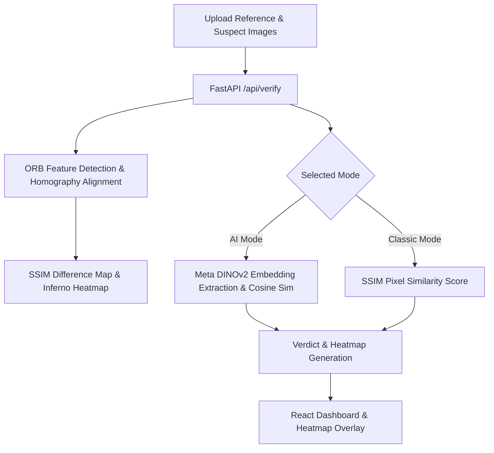

# 🔍 TamperLens

[](https://fastapi.tiangolo.com/)
[](https://pytorch.org/)
[](https://reactjs.org/)
[](https://vitejs.dev/)
[](https://opencv.org/)

> **Enterprise-Grade AI & Computer Vision System for Seal & Packaging Integrity Analysis**

TamperLens is an intelligent optical verification system designed to detect subtle visual tampering, counterfeit packaging, broken security seals, and document modifications. By combining deep vision transformers (**Meta DINOv2**) with robust geometric computer vision (**ORB Feature Matching + RANSAC Homography + SSIM Heatmaps**), TamperLens delivers real-time pixel-level anomaly localization and semantic authenticity scoring.

---

## ✨ Key Features

- 🧠 **Dual Analysis Engine**:
  - **AI Mode (Neural / Semantic)**: Uses Meta's self-supervised foundation model (`facebook/dinov2-small`) to compute high-dimensional feature embeddings and measure deep semantic drift.
  - **Classic Mode (Pixel Alignment)**: Uses Structural Similarity Index Measure (SSIM) and OpenCV ORB feature alignment with RANSAC to detect microscopic alterations regardless of camera tilt or scale variations.
- 🔥 **Visual Anomaly Heatmaps**: Real-time OpenCV `COLORMAP_INFERNO` discrepancy overlay revealing altered text, breached seals, or modified regions.
- ⚡ **Real-Time Verification**: High-throughput FastAPI asynchronous backend supporting GPU/CUDA acceleration and CPU fallbacks.
- 🎨 **Futuristic Cyberpunk UI**: Sleek, glassmorphism dark-mode interface built with React 19 and Vite.
- 📊 **Audit & Activity History**: Localized verification log with confidence scores, timestamps, and verdict classifications (`AUTHENTIC`, `SUSPICIOUS`, `TAMPERED`).

---

## 🛠️ Tech Stack

### **Backend**
- **Framework**: FastAPI & Uvicorn (Asynchronous REST API)
- **AI & Deep Learning**: PyTorch, Hugging Face Transformers (`facebook/dinov2-small`)
- **Computer Vision**: OpenCV (`cv2`), Scikit-Image (`skimage.metrics.ssim`), Pillow, NumPy

### **Frontend**
- **Framework**: React 19 + Vite
- **Styling**: Vanilla CSS (Custom Design System, Glassmorphism, Material Symbols)
- **State Management**: React Hooks + LocalStorage Persistence

---

## 🔬 How It Works



---

## 🚀 Getting Started

Follow the steps below to run both the backend and frontend locally.

### Prerequisites
- **Python 3.9+**
- **Node.js 18+** & `npm`

---

### Part 1: Start the Backend (Python API)

Open your first terminal:

1. **Navigate to the backend directory:**
   ```bash
   cd backend
   ```

2. **Create a virtual environment** *(first time only)*:
   ```bash
   python -m venv .venv
   ```

3. **Activate the virtual environment:**
   - **Windows (PowerShell):**
     ```powershell
     .\.venv\Scripts\activate
     ```
   - **Windows (CMD):**
     ```cmd
     .venv\Scripts\activate.bat
     ```
   - **Mac / Linux:**
     ```bash
     source .venv/bin/activate
     ```

4. **Install dependencies:**
   ```bash
   pip install -r requirements.txt
   ```

5. **Start the API server:**
   ```bash
   python api.py
   ```
   *The backend will be running at `http://localhost:8000`.*

---

### Part 2: Start the Frontend (React Application)

Open a **second terminal**:

1. **Navigate to the frontend directory:**
   ```bash
   cd frontend
   ```

2. **Install Node dependencies** *(first time only)*:
   ```bash
   npm install
   ```

3. **Start the development server:**
   ```bash
   npm run dev
   ```

4. **Open in your browser:**
   ```
   http://localhost:5173
   ```

---

## 📡 API Reference

### **Endpoint: Verify Images**
- **URL**: `/api/verify`
- **Method**: `POST`
- **Content-Type**: `multipart/form-data`

#### **Parameters:**
| Parameter | Type | Description |
|---|---|---|
| `mode` | `string` | Verification mode: `"ai"` or `"classic"` |
| `file1` | `file` | Original / Reference authentic image |
| `file2` | `file` | Suspect image to be verified |

#### **Sample Response:**
```json
{
  "success": true,
  "score": 96.45,
  "status": "AUTHENTIC",
  "modeUsed": "Meta DINOv2 (AI)",
  "heatmap": "data:image/jpeg;base64,..."
}
```

---

## 📂 Project Structure

```
TamperLens/
├── .gitignore              # Global git ignore (caches, envs, models)
├── README.md               # Project documentation
├── backend/
│   ├── api.py              # FastAPI server, DINOv2 & SSIM logic
│   └── requirements.txt    # Python dependencies
└── frontend/
    ├── index.html          # HTML entrypoint
    ├── package.json        # Frontend dependencies
    ├── vite.config.js      # Vite configuration
    └── src/
        ├── App.jsx         # Main verification interface
        ├── App.css         # UI & layout styling
        ├── index.css       # Design tokens & background effects
        └── main.jsx        # React root mount
```

---

## 👤 Author

**Hasnain Ali**
- GitHub: [@hasnaintanoli](https://github.com/hasnaintanoli)
